# Campus Concierge

**One conversation for your whole campus.** Campus Concierge is an AI campus assistant built for JunctionX Kyutech 2026 (Track 02, Hack Connected Everywhere). Students ask in plain language and the assistant answers, plans and books across classes, assignments, events, study rooms, the campus bus, cafes and the clinic.

> **Prototype notice:** all data is simulated (mock JSON files) and every name, address and ID is fictional. There is no login and no connection to any real school system.

**Team:** Desmond Chew Boon Cong, Raymond Ng Chian Quan, Sashvhant A/L Vadevell, Poh Kok Hao

---

## What it does

| | |
|---|---|
| **Answer** | Ask about courses, assignments, events, buses, cafe crowds, the clinic and your timetable in natural language. |
| **Plan** | Multi-step questions are answered in one go: "Can I grab a coffee before my next class?", "How do I get to class?", "Plan my day", "Which events can I go to without missing class?" |
| **Act** | Books study rooms, sports facilities and clinic visits. The assistant proposes a slot and **you confirm with one tap**; it never books on its own. |
| **Protect** | If a booking overlaps a class it warns you first, but you can still book it. |

Beyond the chat there is a full app: dashboard, live bus map, course pages (materials, assignments, quizzes, grades, attendance), bookings, profile, finance and forms, and a Scan / Pay / ID screen.

## Screenshots

### The assistant

<table>
<tr>
<td align="center">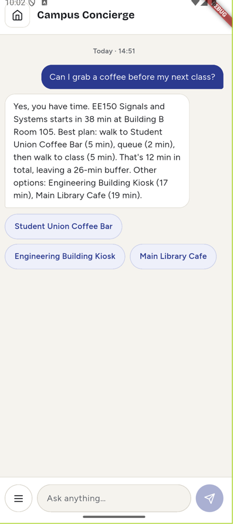<br><sub><b>One question, several services.</b> Timetable, cafe queue and walking time combined.</sub></td>
<td align="center">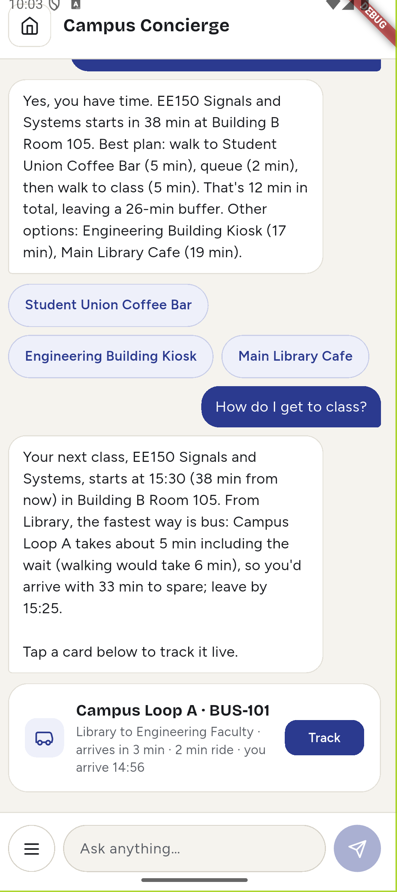<br><sub><b>Get to class.</b> Bus vs walking, and a card that opens live tracking.</sub></td>
<td align="center">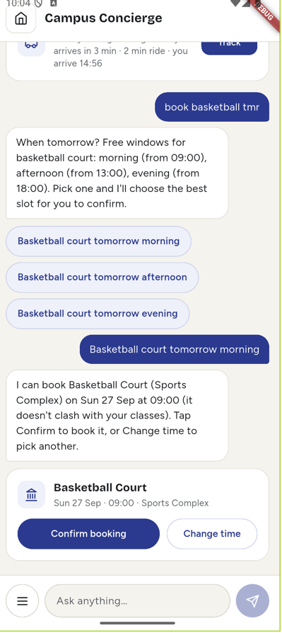<br><sub><b>Propose, then confirm.</b> The assistant picks a free slot; you decide.</sub></td>
</tr>
<tr>
<td align="center">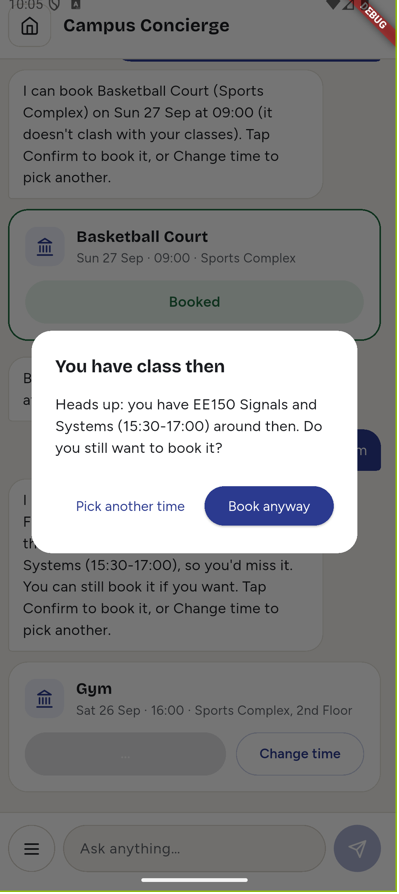<br><sub><b>Class-clash warning.</b> It warns you, and you stay in control.</sub></td>
<td align="center">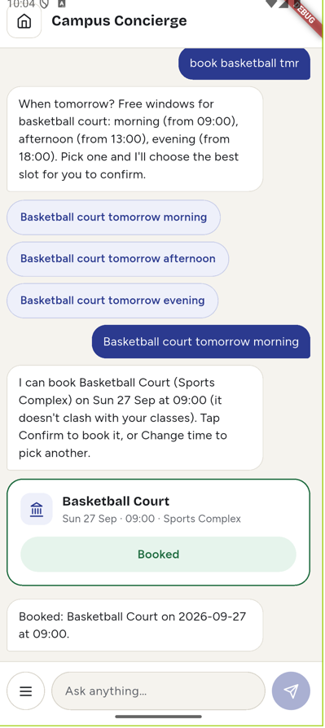<br><sub><b>Booked.</b> Confirmed with one tap.</sub></td>
<td align="center">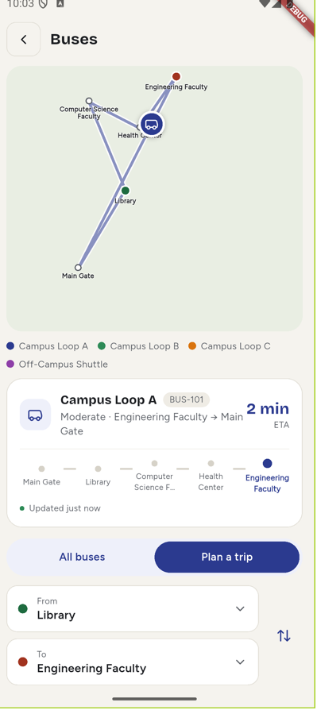<br><sub><b>Live bus tracking</b> from a chat card, with moving buses.</sub></td>
</tr>
</table>

### The app

<table>
<tr>
<td align="center">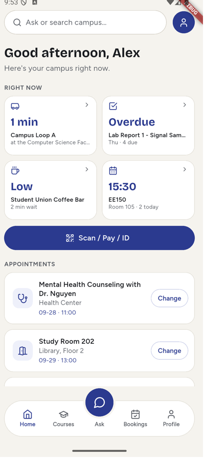<br><sub><b>Dashboard.</b> Bus, what is due, cafes and the timetable at a glance.</sub></td>
<td align="center">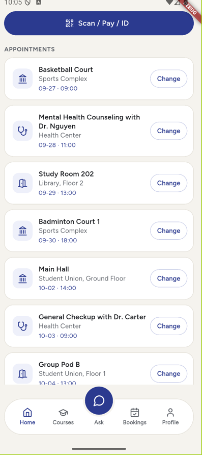<br><sub><b>Appointments</b> with a Change button on each booking.</sub></td>
<td align="center">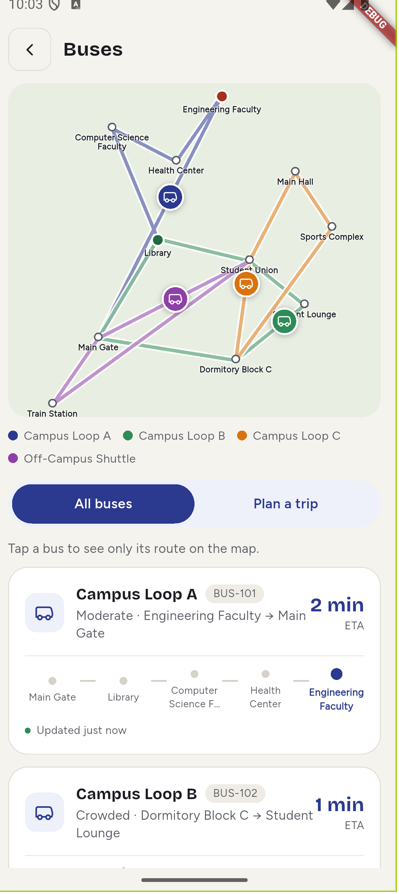<br><sub><b>Buses.</b> All routes on a mock campus map, plus a trip planner.</sub></td>
</tr>
<tr>
<td align="center">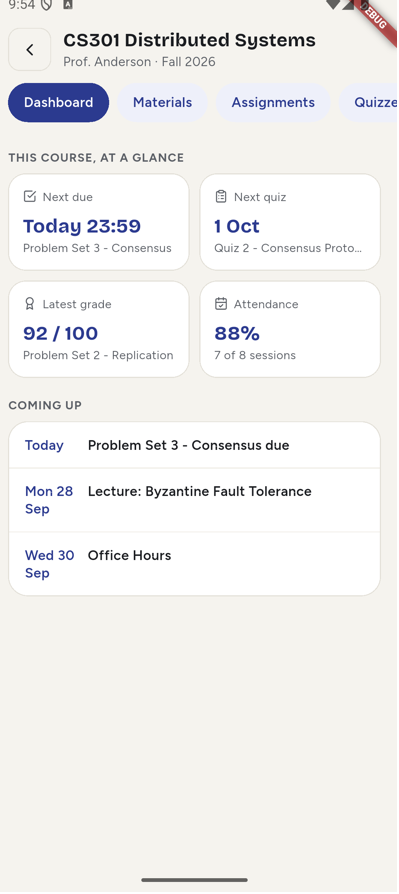<br><sub><b>Course page.</b> Materials, assignments, quizzes, grades, attendance, calendar.</sub></td>
<td align="center">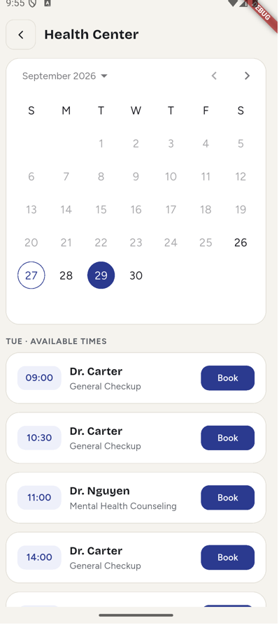<br><sub><b>Health Center.</b> Pick a day, then a time.</sub></td>
<td align="center">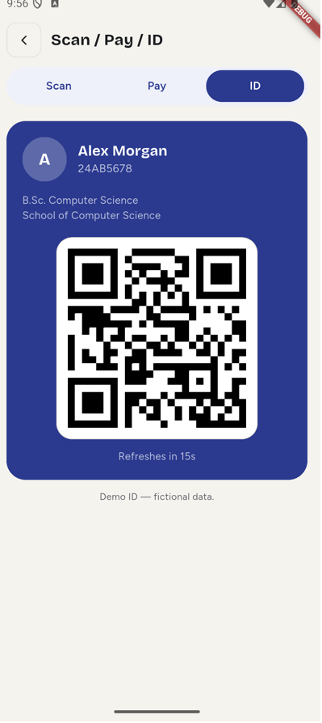<br><sub><b>Scan / Pay / ID.</b> A rotating student ID QR code.</sub></td>
</tr>
<tr>
<td align="center">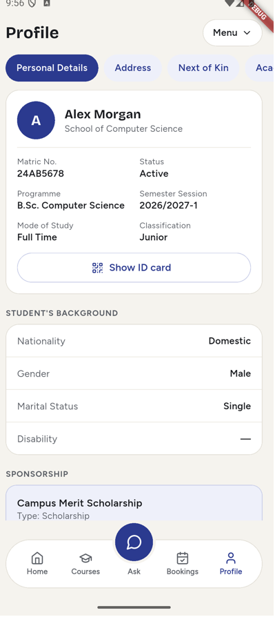<br><sub><b>Profile</b> with MyRegister, MyFinance and MyForm in the menu.</sub></td>
<td></td>
<td></td>
</tr>
</table>

## How it works

```
Flutter app  ──HTTP──►  FastAPI backend  ──►  AI model (function calling)
                              │
                              ├── connectors/  one small file per campus service
                              └── data/        mock JSON files
```

- **Connector pattern.** Each campus service (events, rooms, bus, clinic, academic and so on) is one small connector with its own mock data file. Adding a service means adding one connector; the agent loop does not change.
- **Model-agnostic.** The backend talks to any OpenAI-compatible API. A school can use a cloud provider under its own contract, or run an open model on its own server (for example Ollama or vLLM) so student data never leaves campus. Small local models may be less reliable at choosing tools, so run `python eval_questions.py` against any model before relying on it.
- **The model never does the maths.** Walking times, whether there is time for coffee, bus waits and class clashes are computed in Python by planner tools. The model only picks the tool and phrases the result. Planner tools return a finished `summary` sentence that the reply must use.
- **Booking always needs a tap.** The assistant only proposes bookings (`propose_booking`). Confirm calls the booking API directly with the exact details shown on the card.
- **Class clashes are a warning, not a block.** The backend returns `needs_confirmation` and only books with `force=true` after the student agrees.
- **Simulated buses.** Bus positions are computed from the clock and the routes in `data/campus_map.json`; nothing is stored.

## Tech stack

- **Frontend:** Flutter (Dart), `google_fonts`, `lucide_icons`, `mobile_scanner`, `qr_flutter`
- **Backend:** Python, FastAPI, Uvicorn
- **AI:** any model with an OpenAI-compatible API and function calling. The demo uses DeepSeek (`deepseek-chat`); the model, address and key are settings in `backend/.env`
- **Data:** mock JSON files under `data/`

## Getting started

You need Python 3.11+, Flutter, and an API key for an OpenAI-compatible model (the demo uses DeepSeek).

### 1. Backend

```bash
python3 -m venv venv
source venv/bin/activate
pip install -r backend/requirements.txt

cp backend/.env.example backend/.env
# edit backend/.env and set DEEPSEEK_API_KEY
# To use a different model, set LLM_BASE_URL, LLM_MODEL and LLM_API_KEY instead (see .env.example)
# GOOGLE_MAPS_API_KEY is optional (it only affects walking-time lookups)

cd backend
uvicorn main:app --reload
```

The API runs on `http://localhost:8000`.

### 2. Frontend

```bash
cd frontend
flutter pub get
flutter run
```

The Android emulator reaches your machine at `10.0.2.2:8000`, which the app already uses. iOS simulator and web use `localhost:8000`.

## Demo helpers

Run these from the `backend` folder.

| Command | What it does |
|---|---|
| `python demo_reset.py` | Clears appointments, chat, scans and forms and restores clinic slots (also `POST /reset-demo`). Add `--sample` to start with sample appointments. |
| `DEMO_CLOCK=fixed uvicorn main:app --reload` | Freezes the clock at Sat 26 Sep 2026, 14:50 so answers stay the same. Without it the app uses the real current time. |
| `python eval_questions.py` | Sends about 50 likely questions to the assistant and checks it used the right tool and gave a sensible reply (calls the DeepSeek API). |

## Project structure

```
backend/
  main.py               API entry point (/chat, /history, /reset-demo) 
  agent.py              system prompt, tool list and the tool-calling loop
  api_routes.py         REST endpoints used by the app's pages
  connectors/           one file per campus service and planner
  eval_questions.py     pre-demo question checks
  demo_reset.py         restore demo data
data/                   mock data (data/seed/ holds the clean copies)
frontend/lib/
  screens/              app pages
  widgets/              shared UI pieces
docs/screenshots/       images used in this README
```

